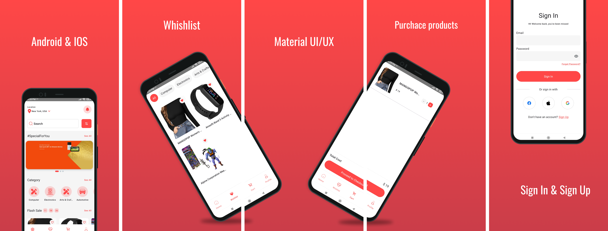
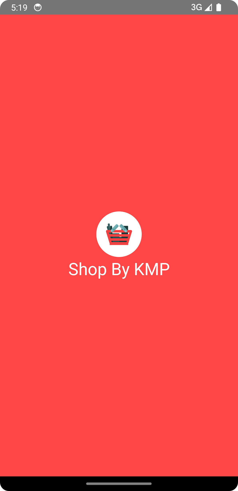
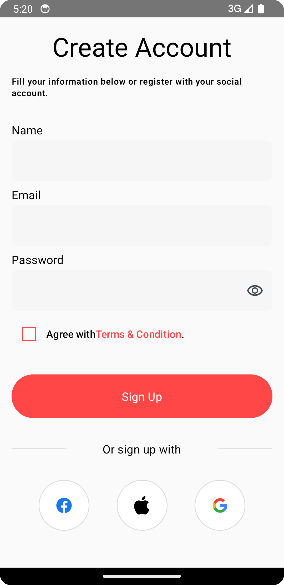
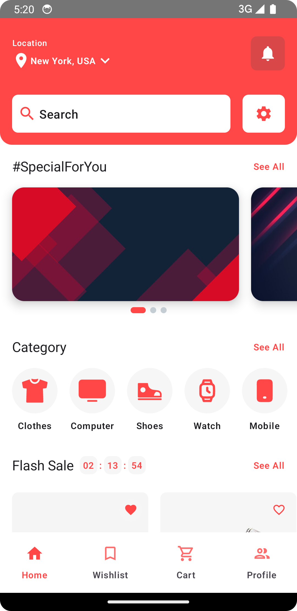
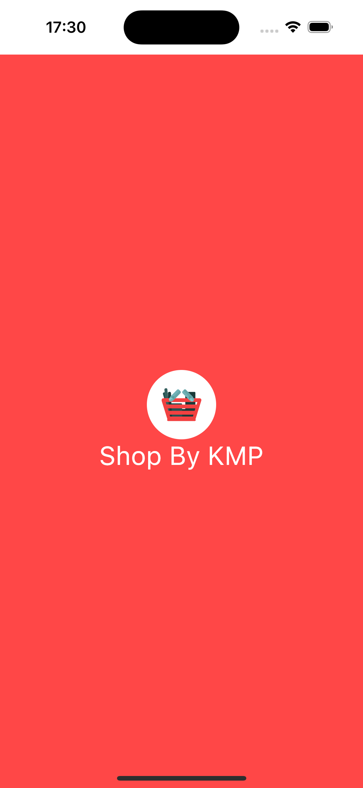
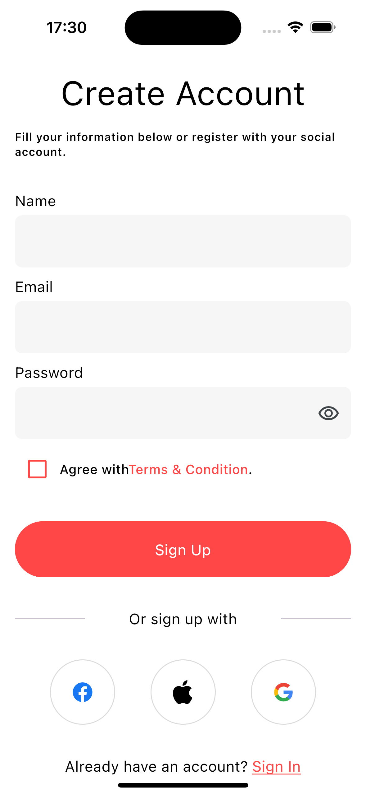
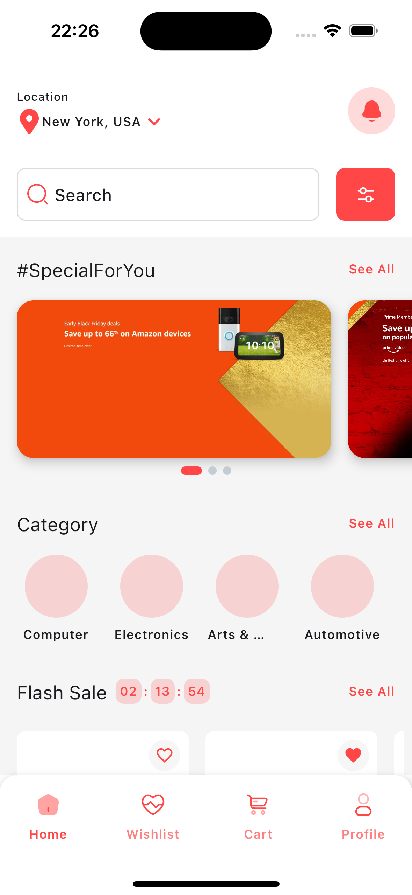

# Shopping-By-KMP (Compose Multiplatform application)

Welcome to the documentation for the Jetpack Compose Multiplatform Shopping Application! 
This is a cross-platform application that is built using Jetpack Compose Multiplatform, a declarative framework for sharing UIs across multiple platforms with Kotlin. 
The application allows users to browse, search, and purchase products from a shopping catalog on Android, iOS.

https://github.com/razaghimahdi/Shopping-By-KMP/assets/61207818/a4702cbf-1449-48b0-88f1-bcb9c42d273e

## Give a Star! ⭐
If you like or are using this project to learn or start your solution, please give it a star. Thanks!

## Related Articles📄
[How to handle error in best practice](https://medium.com/@razaghimahdi78/how-to-handle-errors-in-jetpack-compose-with-mvi-and-clean-architecture-55ab17b9c82d)

[How to set up Convention Gradle Plugin in CMP](https://medium.com/@razaghimahdi78/creating-convention-gradle-plugin-for-compose-multiplatform-1b4051e98f61)

[How to create custom Number Formatting in CMP](https://medium.com/@razaghimahdi78/number-formatting-in-jetpack-compose-multiplatform-b3fd01308f6c)

## Features ✨
| Feature                     | Status           |
|-----------------------------|------------------|
| Login, Sign Up              | ✔️ Implemented   |
| Home                        | ✔️ Implemented   |
| Product Detail and Comments | ✔️ Implemented   |
| Wishlist                    | ✔️ Implemented   |
| Cart                        | ✔️ Implemented   |
| Profile                     | ✔️ Implemented   |
| Search                      | ✔️ Implemented   |
| Category                    | ✔️ Implemented   |
| Edit Profile                | ✔️ Implemented   |
| Manage Address              | ✔️ Implemented   |
| Payment Method              | ✔️ Implemented   |
| My Orders                   | ✔️ Implemented   |
| My Coupons                  | ✔️ Implemented   |
| Notifications               | ✔️ Implemented   |
| Setting                     | ✔️ Implemented   |

## **Next Features 🏄‍♂️**
Obviously it would be more updates, What we are working on these days?
- **Product Comparison:** Easily compare features, prices, and reviews of two products side by side for a smarter shopping choice.
  
## **Latest Features 🏄‍♂️**
- In last updated, I added `map` to managing address. So user can select its location before adding address information to be more specific

#### **Future Plans:**
- **Web platfrom:** Soon we gonna have release for web

## Tech Stack 📚
- Kotlin Multiplatform 
- Kotlin Coroutines 
- Compose Multiplatform 
- Material3 
- Ktor 
- Datastore 
- Compose Navigation and Type safety
- Koin
- Coil3
- Kotest
- Fake Data
<!-- - Mockk -->
<!-- - Turbine -->

## Development 💻

Firs, let me say the backend is also in progress. You can find the backend source code [here](https://github.com/aydenGill/shop-admin-panel).

We appreciate any feedback or suggestions that you may have to help us improve the project.

We plan to add more features, improve the code quality, and make the application more user-friendly. 

Our goal is to create a high-quality, multiplatform shopping application that demonstrates the power and flexibility of Jetpack Compose.

Please stay tuned for updates and feel free to contribute to the project by submitting pull requests or opening issues. 
Together, we can create a great shopping application that meets the needs of users across multiple platforms.

## Challenges Faced 👨‍💻
During the development of this project, 
i encountered several challenges that required creative solutions. 
Some of the key challenges I addressed include:

- **Native Functionality Challenges:** Implementing native functionalities posed challenges in image selection, camera access permissions, location access permissions, google maps, status bar customization, and image upload via Ktor.
- **UI Testing:** Developing comprehensive UI tests across multiple platforms presented challenges in ensuring consistent behavior and visual presentation.
- **Unit Testing:** Writing unit tests for shared code and platform-specific implementations required careful consideration of differences in testing frameworks and environments.
- **User Session Management:** Securely managing user sessions across platforms involved implementing robust authentication mechanisms while prioritizing privacy and security.
- **UI/UX Design:** Crafting an intuitive and visually appealing UI/UX for diverse devices presented creative challenges, driving iterative design processes.

These challenges underscored the complexity of developing a cross-platform shopping application and pushed us to innovate and refine our solutions continually.

## Architecture 🏢
The Jetpack Compose Multiplatform Shopping Application is built using the Clean Architecture and the MVI (Model-View-Intent) pattern. 

## Testing 🧪
Testing is a crucial aspect of software development to ensure the reliability and functionality of the application. 
In the Shopping-By-KMP project, we utilize various testing frameworks and tools to maintain the quality of our codebase.

<!--
### Android 📱

When Android is one of your targets, 
you can get the same experience for Android as if you were developing an Android app using Jetpack Compose.

| Splash                                            | Sign In                                           | Sign Up                                           | Main(Home)                                        |
|---------------------------------------------------|---------------------------------------------------|---------------------------------------------------|---------------------------------------------------|
|  |  |  |  |
-->
<!--
### IOS 📱
> iOS support is in Alpha. It may change incompatibly and require manual migration in the future.

Compose Multiplatform shares most of its API with Jetpack Compose, the Android UI framework developed by Google. 
You can use the same APIs to build user interfaces for both Android and iOS.

| Splash                                        | Sign In                                       | Sign Up                                       | Main(Home)                                    |
|-----------------------------------------------|-----------------------------------------------|-----------------------------------------------|-----------------------------------------------|
|  |  |  |  |
-->

## Backend 🌐
[This project](https://github.com/aydenGill/shop-admin-panel) involves building a robust admin panel for managing an e-commerce platform. 
It utilizes **Laravel** for the backend structure and **Livewire** for dynamic frontend interactions. 
The panel comes with a comprehensive **API**, ensuring scalability and flexibility.

### Features
- **Admin Dashboard:** Manage products, categories, orders, and customers seamlessly.
- **Laravel & Livewire:** Leverage the power of Laravel's backend with Livewire for reactive UI.
- **Full API:** Enables external integrations and interactions with the shopping platform.

## Contributing
Contributions are welcome! If you have any feedback or suggestions, please don't hesitate to let us know. 
We appreciate your contributions and support. Also if you find a bug or would like to create a new feature, please submit a pull request.

## License
This library is licensed under the MIT License. See [LICENSE.txt](https://github.com/razaghimahdi/Shoping-By-KMP/blob/master/LICENSE)

### more ideas:
https://github.com/JetBrains/compose-multiplatform-ios-android-template
https://github.com/JetBrains/compose-multiplatform

Developed by Mahdi Razzaghi Ghaleh
