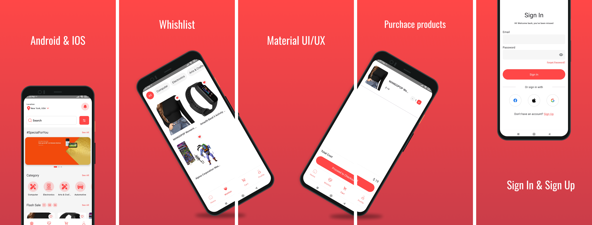

# Shopping-By-KMP (Full-Stack Compose Multiplatform)

Welcome to the documentation for the Jetpack Compose Multiplatform Shopping Application!
This is a cross-platform, full-stack application built entirely in Kotlin. It utilizes Jetpack Compose Multiplatform for sharing declarative UIs across multiple platforms, and features a seamlessly integrated Ktor backend engine to power the data layer.

The application allows users to browse, search, and purchase products from a shopping catalog on Android, iOS, Desktop, Web, Automotive, and AndroidTV.




### Android & IOS
https://github.com/razaghimahdi/Shopping-By-KMP/assets/61207818/a4702cbf-1449-48b0-88f1-bcb9c42d273e

### Desktop
https://github.com/user-attachments/assets/2ceedcef-0ec8-4886-904a-3975e6c2ea6f

### AndroidTV
https://github.com/user-attachments/assets/9b7cbb10-3f95-4355-a9c7-3b23147dda18

### Web
#### [Live](https://razaghimahdi.github.io/Shopping-By-KMP/)
https://github.com/user-attachments/assets/808a72b9-d591-44e4-a29f-16a1fd99e462

## Give a Star! ⭐
If you like or are using this project to learn or start your solution, please give it a star. Thanks!

## Related Articles📄
* [How to handle errors in best practice](https://medium.com/@razaghimahdi78/how-to-handle-errors-in-jetpack-compose-with-mvi-and-clean-architecture-55ab17b9c82d)
* [How to set up Convention Gradle Plugin in CMP](https://medium.com/@razaghimahdi78/creating-convention-gradle-plugin-for-compose-multiplatform-1b4051e98f61)
* [How to create custom Number Formatting in CMP](https://medium.com/@razaghimahdi78/number-formatting-in-jetpack-compose-multiplatform-b3fd01308f6c)
* [How to upload in CMP Using Ktor](https://medium.com/@razaghimahdi78/uploading-in-compose-multiplatform-using-ktor-a-comprehensive-guide-f2dd28799a20)

## Features ✨
| Feature                     | Status           |
|-----------------------------|------------------|
| Login, Sign Up              | ✔️ Implemented   |
| Home                        | ✔️ Implemented   |
| Product Detail and Comments | ✔️ Implemented   |
| Wishlist                    | ✔️ Implemented   |
| Cart / Basket               | ✔️ Implemented   |
| Profile & Edit Profile      | ✔️ Implemented   |
| Search & Category           | ✔️ Implemented   |
| Manage Address              | ✔️ Implemented   |
| Payment Method              | ✔️ Implemented   |
| My Orders                   | ✔️ Implemented   |
| My Coupons                  | ✔️ Implemented   |
| Notifications & Setting     | ✔️ Implemented   |

## Latest Features 🚀
### ⚡ Full-Stack KMP Architecture
We have officially migrated to a full-stack monorepo! The project now includes a nested `:server` Ktor module that connects to a local MySQL database, eliminating the need for fake data and allowing end-to-end Kotlin development.
### 🚗 Automotive Support
Added `AutomotiveApp` — the application is now compatible with **Android Automotive OS**, making it available for in-car systems.
### 🌐 Web Support
Introduced `WebApp` — access the app directly from your browser.
### 📺 Android TV Support
Added `TvApp` — enjoy the app on **Android TV** devices.
### 💻 Desktop Support
Introduced `DesktopApp` — the app now runs on desktop environments (Windows, macOS, Linux).
### 🗺️ Google Maps Integration
Integrated `GoogleMap` for enhanced address input. Users can now select their location on the map before filling out address details, ensuring greater precision.

## Tech Stack 📚
**Client (Compose Multiplatform):**
- Kotlin Multiplatform & Coroutines
- Compose Multiplatform (UI framework)
- Material3
- Ktor Client (Networking)
- Datastore (Local Storage)
- Compose Navigation (Type safety)
- Koin (Dependency Injection)
- Coil3 (Image Loading with global interceptors)

**Server (Ktor Backend):**
- Ktor Server (Netty)
- Exposed (SQL ORM)
- MySQL & HikariCP (Database & Connection Pooling)
- BCrypt (Password Hashing)
- JWT Authentication

## Architecture 🏢
This repository implements Clean Architecture and the MVI (Model-View-Intent) pattern, structured within a modular, full-stack Gradle setup:
* **`:core`**: Shared DTOs, models, and networking constants used by both client and server.
* **`:server`**: The Ktor JVM backend engine and database configuration.
* **`:app`**: Nested directory containing platform-specific targets (`:app:androidApp`, `:app:desktopApp`, `:app:webApp`) and the shared Compose UI module (`:app:shared`).

## Quick Start: Running the Backend 🌐
The project now runs on an integrated Ktor 3.x backend connected to a local MySQL database. To start the API locally:

1. **Database Setup:**
   Ensure MySQL is running on your machine on port `3306`. Create a new database named `shopping_db`.
2. **Configure Credentials:**
   Open `DatabaseFactory.kt` inside the `:server` module and update the `user` and `password` variables to match your local MySQL configuration.
3. **Run the Server:**
   Execute the following Gradle task to auto-generate the database tables and start the API on `http://localhost:8080` (or `10.0.2.2` for Android emulators):
   ```bash
   ./gradlew :server:run